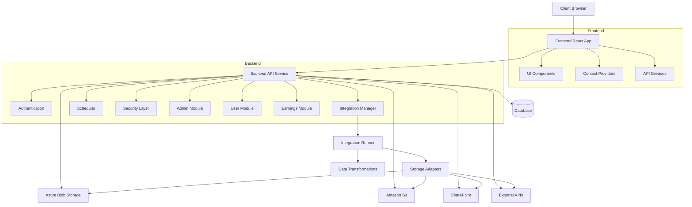

```mermaid
graph TB
    Client[Client Browser] --> FE[Frontend React App]
    FE --> API[Backend API Service]
    API --> DB[(Database)]
    API --> AZURE[Azure Blob Storage]
    API --> S3[Amazon S3]
    API --> SP[SharePoint]
    API --> ExtAPI[External APIs]
    
    subgraph Frontend
        FE --> Components[UI Components]
        FE --> Contexts[Context Providers]
        FE --> Services[API Services]
    end
    
    subgraph Backend
        API --> Auth[Authentication]
        API --> IntMgr[Integration Manager]
        API --> Scheduler[Scheduler]
        API --> Security[Security Layer]
        API --> AdminMod[Admin Module]
        API --> UserMod[User Module]
        API --> EarningsMod[Earnings Module]
    end
    
    IntMgr --> IntRunner[Integration Runner]
    IntRunner --> Adapters[Storage Adapters]
    IntRunner --> Transforms[Data Transformations]
    
    Adapters --> AZURE
    Adapters --> S3
    Adapters --> SP
    Adapters --> ExtAPI
    
    class Client,FE,API,AZURE,S3,SP,ExtAPI,DB emphasis
```