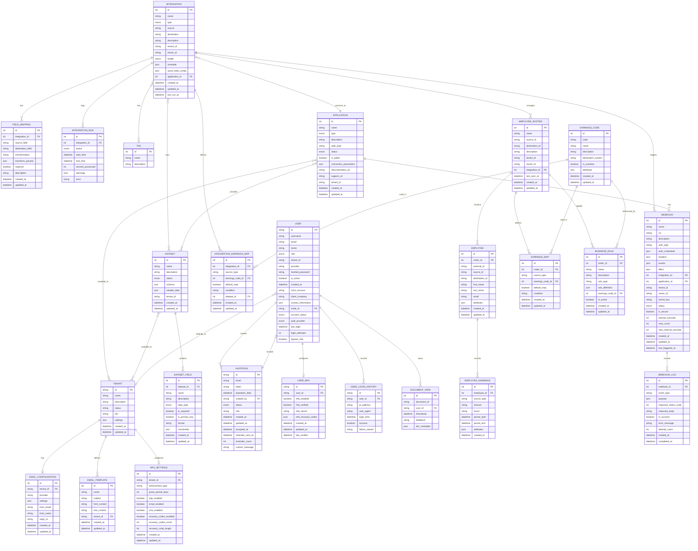

```mermaid
erDiagram
    INTEGRATION ||--o{ FIELD_MAPPING : has
    INTEGRATION ||--o{ INTEGRATION_RUN : logs
    INTEGRATION }o--o{ TAG : has
    INTEGRATION ||--o{ WEBHOOK : triggers
    INTEGRATION }o--o{ DATASET : uses
    INTEGRATION }o--|| APPLICATION : connects_to
    INTEGRATION ||--o{ INTEGRATION_EARNINGS_MAP : defines
    INTEGRATION ||--o{ EMPLOYEE_ROSTER : manages
    
    APPLICATION }o--o{ DATASET : provides
    APPLICATION ||--o{ WEBHOOK : has
    APPLICATION }o--o{ TENANT : available_to
    
    DATASET ||--o{ DATASET_FIELD : contains
    DATASET }o--o{ TENANT : available_to
    
    USER }o--o| TENANT : belongs_to
    USER ||--o{ INVITATION : creates
    USER ||--o| USER_MFA : configures
    USER ||--o{ USER_LOGIN_HISTORY : records
    USER ||--o{ DOCUMENT_VIEW : views
    
    INVITATION ||--o| USER : accepts
    
    EMPLOYEE_ROSTER ||--o{ EMPLOYEE : contains
    EMPLOYEE_ROSTER ||--o{ EARNINGS_MAP : defines
    EMPLOYEE_ROSTER ||--o{ BUSINESS_RULE : applies
    
    EMPLOYEE ||--o{ EMPLOYEE_EARNINGS : records
    
    EARNINGS_CODE ||--o{ EARNINGS_MAP : used_in
    EARNINGS_CODE ||--o{ INTEGRATION_EARNINGS_MAP : used_in
    EARNINGS_CODE ||--o{ BUSINESS_RULE : referenced_by
    
    WEBHOOK ||--o{ WEBHOOK_LOG : records
    
    TENANT ||--o| EMAIL_CONFIGURATION : has
    TENANT ||--o{ EMAIL_TEMPLATE : defines
    TENANT ||--o| MFA_SETTINGS : configures
    
    INTEGRATION {
        int id PK
        string name
        enum type
        string source
        string destination
        string description
        string tenant_id
        string owner_id
        enum health
        json schedule
        json azure_blob_config
        int application_id FK
        datetime created_at
        datetime updated_at
        datetime last_run_at
    }
    
    FIELD_MAPPING {
        int id PK
        int integration_id FK
        string source_field
        string destination_field
        string transformation
        json transform_params
        boolean required
        string description
        datetime created_at
        datetime updated_at
    }
    
    APPLICATION {
        int id PK
        string name
        enum type
        string description
        string auth_type
        enum status
        boolean is_public
        json connection_parameters
        string documentation_url
        string support_url
        string tenant_id
        datetime created_at
        datetime updated_at
    }
    
    DATASET {
        int id PK
        string name
        string description
        enum status
        json schema
        json sample_data
        string tenant_id
        datetime created_at
        datetime updated_at
    }
    
    DATASET_FIELD {
        int id PK
        int dataset_id FK
        string name
        string description
        enum data_type
        boolean is_required
        boolean is_primary_key
        string format
        json constraints
        datetime created_at
        datetime updated_at
    }
    
    USER {
        string id PK
        string username
        string email
        string name
        enum role
        string tenant_id
        string provider
        string hashed_password
        boolean is_active
        datetime created_at
        string zoho_account
        string client_company
        json contact_information
        string invite_id FK
        enum account_status
        enum auth_provider
        datetime last_login
        int login_attempts
        boolean bypass_mfa
    }
    
    INTEGRATION_RUN {
        int id PK
        int integration_id FK
        enum status
        datetime start_time
        datetime end_time
        int records_processed
        json warnings
        string error
    }
    
    TAG {
        int id PK
        string name
        string description
    }
    
    WEBHOOK {
        int id PK
        string name
        string url
        string description
        string auth_type
        json auth_credentials
        json headers
        json events
        json filters
        int integration_id FK
        int application_id FK
        string tenant_id
        string owner_id
        string secret_key
        enum status
        boolean is_secure
        int timeout_seconds
        int retry_count
        int retry_interval_seconds
        datetime created_at
        datetime updated_at
        datetime last_triggered_at
    }
    
    WEBHOOK_LOG {
        int id PK
        int webhook_id FK
        string event_type
        json payload
        int response_status_code
        string response_body
        boolean is_success
        string error_message
        int attempt_count
        datetime created_at
        datetime completed_at
    }
    
    EMPLOYEE_ROSTER {
        int id PK
        string name
        string source_id
        string destination_id
        string description
        string tenant_id
        string owner_id
        int integration_id FK
        datetime last_sync_at
        datetime created_at
        datetime updated_at
    }
    
    EMPLOYEE {
        int id PK
        int roster_id FK
        string external_id
        string source_id
        string destination_id
        string first_name
        string last_name
        string email
        json attributes
        datetime created_at
        datetime updated_at
    }
    
    EMPLOYEE_EARNINGS {
        int id PK
        int employee_id FK
        string source_type
        string amount
        string hours
        datetime period_start
        datetime period_end
        json attributes
        datetime created_at
    }
    
    EARNINGS_CODE {
        int id PK
        string code
        string name
        string description
        string destination_system
        boolean is_overtime
        json attributes
        datetime created_at
        datetime updated_at
    }
    
    EARNINGS_MAP {
        int id PK
        int roster_id FK
        string source_type
        int earnings_code_id FK
        boolean default_map
        string condition
        datetime created_at
        datetime updated_at
    }
    
    INTEGRATION_EARNINGS_MAP {
        int id PK
        int integration_id FK
        string source_type
        int earnings_code_id FK
        boolean default_map
        string condition
        int dataset_id FK
        datetime created_at
        datetime updated_at
    }
    
    TENANT {
        string id PK
        string name
        string description
        string status
        string tier
        json settings
        datetime created_at
        datetime updated_at
    }
    
    BUSINESS_RULE {
        int id PK
        int roster_id FK
        string name
        string description
        string rule_type
        json rule_definition
        int earnings_code_id FK
        boolean is_active
        datetime created_at
        datetime updated_at
    }
    
    INVITATION {
        string id PK
        string email
        string token
        datetime expiration_date
        string created_by FK
        enum status
        string role
        datetime created_at
        datetime updated_at
        datetime accepted_at
        datetime reminder_sent_at
        int reminder_count
        string custom_message
    }
    
    USER_MFA {
        string id PK
        string user_id FK
        boolean mfa_enabled
        boolean mfa_verified
        string mfa_secret
        json mfa_recovery_codes
        datetime created_at
        datetime updated_at
        datetime last_verified
    }
    
    USER_LOGIN_HISTORY {
        string id PK
        string user_id FK
        string ip_address
        string user_agent
        datetime login_time
        boolean success
        string failure_reason
    }
    
    EMAIL_CONFIGURATION {
        int id PK
        string tenant_id FK
        string provider
        json settings
        string from_email
        string from_name
        string reply_to
        datetime created_at
        datetime updated_at
    }
    
    EMAIL_TEMPLATE {
        int id PK
        string name
        string subject
        string html_content
        string text_content
        string tenant_id FK
        datetime created_at
        datetime updated_at
    }
    
    MFA_SETTINGS {
        int id PK
        string tenant_id FK
        string enforcement_type
        int grace_period_days
        boolean totp_enabled
        boolean email_enabled
        boolean sms_enabled
        boolean recovery_codes_enabled
        int recovery_codes_count
        int recovery_code_length
        datetime created_at
        datetime updated_at
    }
    
    DOCUMENT_VIEW {
        int id PK
        string document_id
        string user_id FK
        datetime timestamp
        string feedback
        json doc_metadata
    }
```