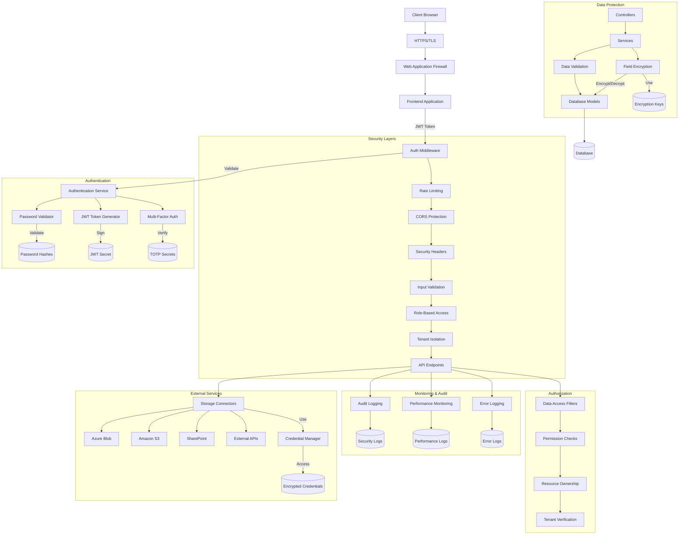

```mermaid
graph TB
    Client[Client Browser] --> HTTPS[HTTPS/TLS]
    HTTPS --> WAF[Web Application Firewall]
    WAF --> FE[Frontend Application]
    FE -- "JWT Token" --> AuthMiddleware[Auth Middleware]
    
    subgraph "Security Layers"
        AuthMiddleware --> RateLimit[Rate Limiting]
        RateLimit --> CORS[CORS Protection]
        CORS --> SecurityHeaders[Security Headers]
        SecurityHeaders --> InputValidation[Input Validation]
        InputValidation --> RBAC[Role-Based Access]
        RBAC --> TenantIsolation[Tenant Isolation]
        TenantIsolation --> API[API Endpoints]
    end
    
    subgraph "Authentication"
        AuthN[Authentication Service]
        PassValidator[Password Validator]
        TokenGenerator[JWT Token Generator]
        MFA[Multi-Factor Auth]
        PassValidator -- "Validate" --> PassHash[(Password Hashes)]
        AuthN --> PassValidator
        AuthN --> TokenGenerator
        AuthN --> MFA
        TokenGenerator -- "Sign" --> TokenSecret[(JWT Secret)]
        MFA -- "Verify" --> TOTPSecret[(TOTP Secrets)]
    end
    
    AuthMiddleware -- "Validate" --> AuthN
    
    subgraph "Authorization"
        API --> DataFilters[Data Access Filters]
        DataFilters --> PermChecks[Permission Checks]
        PermChecks --> ResourceOwner[Resource Ownership]
        ResourceOwner --> TenantCheck[Tenant Verification]
    end
    
    subgraph "Data Protection"
        Controller[Controllers] --> Services[Services]
        Services --> FieldEncrypt[Field Encryption]
        Services --> DataValidation[Data Validation]
        FieldEncrypt -- "Encrypt/Decrypt" --> DBModels[Database Models]
        DataValidation --> DBModels
        FieldEncrypt -- "Use" --> EncryptionKeys[(Encryption Keys)]
    end
    
    DBModels --> DB[(Database)]
    
    subgraph "Monitoring & Audit"
        API --> AuditLog[Audit Logging]
        API --> PerfMonitor[Performance Monitoring]
        API --> ErrorLogging[Error Logging]
        AuditLog --> SecurityLogs[(Security Logs)]
        PerfMonitor --> PerfLogs[(Performance Logs)]
        ErrorLogging --> ErrorLogs[(Error Logs)]
    end
    
    subgraph "External Services"
        API --> Connectors[Storage Connectors]
        Connectors --> AzureBlob[Azure Blob]
        Connectors --> S3[Amazon S3]
        Connectors --> SharePoint[SharePoint]
        Connectors --> ExternalAPI[External APIs]
        
        Connectors -- "Use" --> CredentialManager[Credential Manager]
        CredentialManager -- "Access" --> EncryptedCreds[(Encrypted Credentials)]
    end
    
    class Client,HTTPS,WAF,AuthMiddleware,API,DB,EncryptionKeys,TokenSecret,EncryptedCreds,TOTPSecret emphasis
```